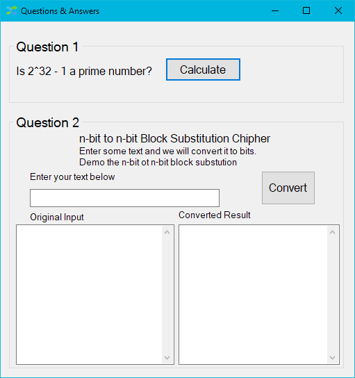
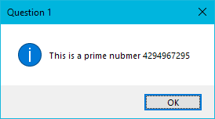
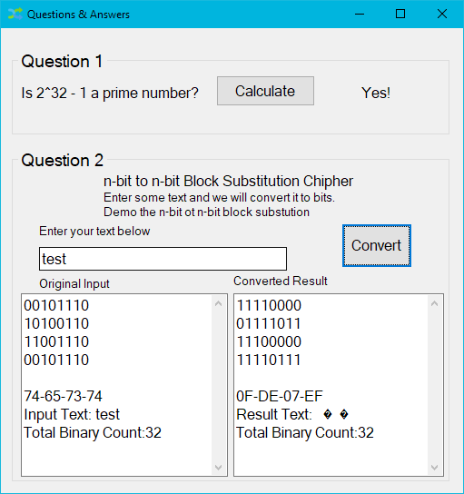

Alternate Number Project
---------------------------

It is a porject with converting between numbers and bits.

* Environment
	* Windows 10
	* Micorsoft C#
	
* IDE
  * Micorsoft Visual Studio Community

* Project Screen Shot

Category | Picture 
----- | ----
Start up Screen | 
Question 1 Answers |  
Question 2 Answers |  